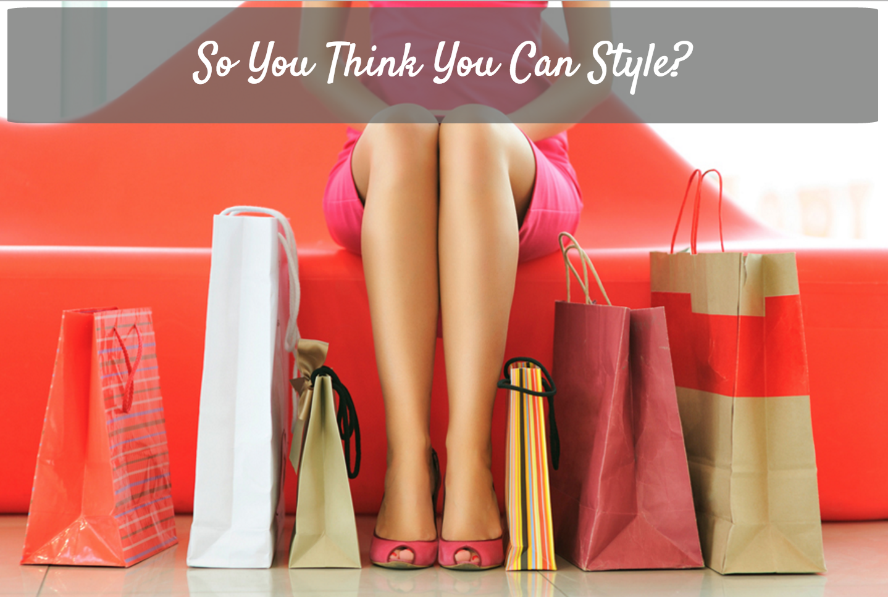

*******************************************************

**Purpose:** Create an interactive game that can be used by retailers to engage customers to check out different items they offer in their stores. This could also be used for employees to find a fun way to familiarize themselves with new and existing product being offered. A fun way to learn what looks good together and how to best meet customers' needs!

**Instructions:** Clients will come in and describes an event for which they need an outfit - it’s YOUR job to pick from a list of 12 items (3 tops, 3 bottoms, 3 accessories). Pair the best top, bottom and accessory together and see what the client thinks! Where will you stand after styling 10 clients? Will you end up looking SO last season or finish being a true fashionista? Try your luck with SO YOU THINK YOU CAN STYLE!

-*******************************************************

**Technologies Used:**
- HTML
- CSS
- javascript
- jQuery
- Drop and Drag functions

**Approach Taken:**

I started this out with grand ideas. I wrote them all down and decided what is the most basic version of this game that I can take. I broke it into steps if I wanted to make this program better each time:

- [x] 1 player, clickable, clients displayed in order
- [x] 1 player, draggable, clients displayed in order
- [ ] 2 player, draggable, clients displayed in order
- [ ] 2 player, draggable, clients displayed at random

**Installation Instructions:**

Follow <a href="http://wileysb88.github.io/project_1/">THIS LINK</a> and begin to play!

Follow <a href="https://github.com/wileysb88/project_1">THIS LINK</a> to check out my code on Github!

**Unsolved Problems:**

- This project was done when I was at 66% zoomed out. I would obviously adjust all elements to be smaller accordingly.

- I cannot figure out how to allow users to drag a picture OUT of the drop zone and back into the main zone. So while it asks if you "like this look" to move on to the next client, you actually cannot change the look once it has been dropped into the appropriate places.

- I wanted to try to loop through the array of clients at random. This would require pushing the clients to a "used" array after cycling through it and emptying "clients" array.

- I had saved the pictures of each article of clothing as a picture into this project so that it wouldn't be affected if the website changed, but forgot to commit to those changes.

- I would like to make this so that if the player chooses the three best styles, a special screen pops up with the look on one full model and the score would be special bonus score.
